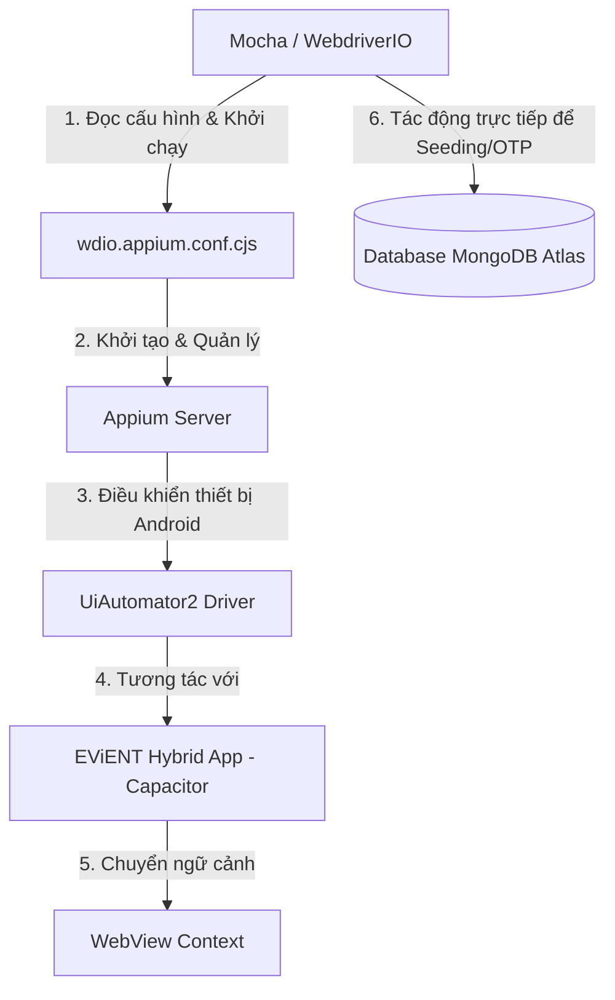

# TÀI LIỆU ĐỌC HIỂU & PHÂN TÍCH MÃ NGUỒN APPIUM AUTOMATION (EViENT)
*Tài liệu hỗ trợ thuyết trình và giải thích cho Giảng viên & Hướng dẫn sử dụng dự án di động*

---

## 1. TỔNG QUAN KIẾN TRÚC & CÔNG NGHỆ AUTOMATION

Hệ thống kiểm thử tự động (Automation Testing) cho ứng dụng di động **EViENT** được xây dựng trên mô hình kiểm thử tích hợp đầu-cuối (End-to-End - E2E) dành cho ứng dụng lai (Hybrid App). 

### Sơ đồ luồng hoạt động công nghệ:


### Các công nghệ cốt lõi:
1. **WebdriverIO (WDIO)**: Khung kiểm thử (Test Runner) chạy trên Node.js, cung cấp cú pháp đơn giản, mạnh mẽ để giao tiếp với Appium.
2. **Appium**: Công cụ mã nguồn mở giúp tự động hóa ứng dụng di động (Android).
3. **UiAutomator2**: Trình điều khiển (Driver) do Google cung cấp để Appium tương tác trực tiếp với các phần tử native của hệ điều hành Android.
4. **Mocha & Expect**: Mocha đóng vai trò định nghĩa cấu trúc kịch bản kiểm thử (`describe`, `it`, `before`, `after`), còn thư viện `Expect` dùng để kiểm tra tính đúng đắn của kết quả (Assertion).
5. **MongoDB Driver**: Kết nối trực tiếp cơ sở dữ liệu MongoDB Atlas để nạp dữ liệu kiểm thử (Seeding) và lấy mã OTP thời gian thực, giúp tự động hóa hoàn toàn luồng đăng ký/đăng nhập mà không phụ thuộc vào dịch vụ gửi SMS/Email thật.
6. **Capacitor (Hybrid App)**: Ứng dụng di động EViENT được xây dựng bằng công nghệ Web nhưng đóng gói chạy trên Native Android thông qua WebView container.

---

## 2. CẤU TRÚC THƯ MỤC CỦA PHẦN AUTOMATION

```text
automation/
├── wdio.appium.conf.cjs       # File cấu hình trung tâm cho WebdriverIO & Appium
├── appium/
│   ├── helpers/
│   │   ├── app.cjs           # Tập hợp các hàm tương tác giao diện (UI Helpers) có chú thích giải thích chi tiết tiếng Việt
│   │   └── test-data.cjs     # Tập hợp các hàm truy cập DB & chuẩn bị dữ liệu (DB Helpers) có chú thích giải thích chi tiết tiếng Việt
│   └── specs/
│       ├── auth.e2e.spec.cjs # Các kịch bản kiểm thử luồng Đăng ký, Đăng nhập, OTP
│       └── admin.e2e.spec.cjs# Các kịch bản kiểm thử dành cho quyền Quản trị viên (Admin)
```

---

## 3. PHÂN TÍCH CHI TIẾT TỪNG FILE MÃ NGUỒN

### 3.1. File cấu hình: `wdio.appium.conf.cjs`
Đây là "trái tim" của hệ thống kiểm thử, thiết lập môi trường hoạt động cho Appium và WebdriverIO.

*   **Chỉ định ứng dụng APK cần test:**
    ```javascript
    const apkPath = process.env.EVIENT_APK_PATH
      || path.join(mobileAppDir, 'android', 'app', 'build', 'outputs', 'apk', 'debug', 'app-debug.apk');
    ```
    *Ý nghĩa:* Tự động tìm kiếm file cài đặt APK đã được build ở thư mục native Android để cài đặt lên thiết bị giả lập.

*   **Cấu hình Capabilities (Khả năng tương tác của Appium):**
    ```javascript
    capabilities: [{
      platformName: 'Android',
      'appium:automationName': 'UiAutomator2',
      'appium:deviceName': process.env.EVIENT_ANDROID_DEVICE || 'Android Emulator',
      'appium:app': apkPath,
      'appium:autoWebview': true, // CỰC KỲ QUAN TRỌNG
      'appium:autoWebviewTimeout': 20000,
      'appium:chromedriverAutodownload': true,
    }]
    ```
    *Phân tích điểm nổi bật cho GV:*
    *   `'appium:autoWebview': true`: Vì EViENT là Hybrid App (Capacitor), giao diện thực chất chạy trên một trình duyệt thu nhỏ (WebView) bên trong ứng dụng Android native. Thuộc tính này ra lệnh cho Appium tự động chuyển từ ngữ cảnh "Native" sang "WebView" ngay khi app khởi động, giúp kiểm thử viên có thể sử dụng các selector của Web chuẩn như CSS selector (`[data-testid="..."]`) để tìm kiếm element thay vì phải dùng XPath phức tạp của Android.
    *   `'appium:chromedriverAutodownload': true`: Tự động tải phiên bản ChromeDriver phù hợp để điều khiển WebView tùy theo phiên bản Android của thiết bị giả lập.

---

### 3.2. File thư viện tương tác UI: `appium/helpers/app.cjs`
*Đọc các bình luận chú thích dạng `// Giải thích cho GV: ...` trực tiếp bên trong file nguồn này để trình bày trực quan.*
*   **`switchToWebView(timeoutMs)`**: Chuyển đổi ngữ cảnh từ khung Android native sang môi trường Chromium WebView để điều khiển Web DOM di động.
*   **`waitForTestId(testId, timeout)`**: Chờ thông minh cho đến khi phần tử HTML chứa thuộc tính `data-testid` tương ứng xuất hiện trên giao diện.
*   **`getFieldValidity(selector)`**: Sử dụng `browser.execute()` để gọi trực tiếp các phương thức của trình duyệt (`checkValidity()`) nhằm kiểm chứng tính hợp lệ HTML5 Form Constraints.
*   **`fillOtpCode(otpCode)`**: Tự động phân tách chuỗi mã số OTP 6 ký tự thành từng chữ số đơn lẻ và gõ lần lượt vào 6 ô input từ `otp-input-0` đến `otp-input-5`.

---

### 3.3. File cơ sở dữ liệu: `appium/helpers/test-data.cjs`
*Đọc các bình luận chú thích dạng `// Giải thích cho GV: ...` trực tiếp bên trong file nguồn này để trình bày trực quan.*
*   **`upsertUser(user)`**: Tự động nạp trước (seeding) dữ liệu người dùng vào MongoDB Atlas. Mật khẩu mẫu được mã hóa an toàn bằng thuật toán băm `bcryptjs` tương thích hoàn toàn với Backend để tạo ra dòng dữ liệu chuẩn xác nhất.
*   **`waitForLatestOtp({ email, type })`**: **Kỹ thuật quét dữ liệu (Database Polling)**. Script chạy vòng lặp truy vấn DB sau mỗi 500ms để bắt mã OTP được sinh ra sau khi click đăng ký, lấy mã số và tự động điền vào màn hình xác thực trên Emulator, giúp tự động hóa khép kín 100%.

---

### 3.4. Các kịch bản kiểm thử: `appium/specs/auth.e2e.spec.cjs` & `admin.e2e.spec.cjs`
Chứa 8 ca kiểm thử chi tiết bao quát luồng xác thực và các chức năng Admin:
*   **AUTH-01 / AUTH-02**: Chặn form đăng nhập khi bỏ trống Email/Mật khẩu.
*   **AUTH-03**: Báo lỗi tiếng Việt chuẩn khi đăng nhập sai mật khẩu (*"Email hoặc mật khẩu không đúng"*).
*   **AUTH-04**: Chặn form đăng ký khi bỏ trống Họ tên.
*   **AUTH-05**: Báo lỗi trùng lặp khi đăng ký email đã tồn tại (*"Email đã được đăng ký"*).
*   **AUTH-06**: Báo lỗi khi nhập sai mã xác minh OTP (*"Mã OTP không hợp lệ hoặc đã hết hạn"*).
*   **AUTH-07**: Xác minh thành công luồng Đăng ký tài khoản mới bằng OTP thật truy cập từ MongoDB Atlas.
*   **AUTH-08**: Đăng nhập nhanh tài khoản mẫu ở chế độ phát triển (OTP-skip).
*   **Admin Flow**: Đăng nhập quyền Quản trị viên $\rightarrow$ Truy cập Dashboard $\rightarrow$ Mở Sidebar chuyển sang Quản lý người dùng $\rightarrow$ Tìm kiếm tài khoản và xác minh hiển thị.

---

## 4. CÁC ĐIỂM SÁNG KỸ THUẬT NỔI BẬT ĐỂ BÁO CÁO GIÁO VIÊN

Khi giáo viên hỏi về **điểm đặc sắc hoặc kỹ thuật khó**, hãy đưa ra 4 nội dung sau:
1.  **Chuyển đổi Ngữ cảnh ứng dụng lai (Hybrid Context Switching)** tự động, giúp tương tác trực tiếp với DOM Web bằng CSS Selector.
2.  **Khử phụ thuộc bên ngoài bằng cách kết nối DB trực tiếp (Real DB Seeding & OTP Bypass)** qua cơ chế Polling thời gian thực để bắt OTP thật.
3.  **Smart Explicit Waits**: Không dùng lệnh ngủ cứng (hard sleep) gây chậm trễ, mà dùng lệnh đợi động của WebdriverIO để đạt hiệu năng tối ưu nhất.
4.  **Kiểm tra tính hợp lệ cấp trình duyệt (Native HTML5 Form Validation)** bằng cách chạy JavaScript kiểm tra API `checkValidity()` ngay trong WebView.

---

## 5. HƯỚNG DẪN CÀI ĐẶT & CHẠY DỰ ÁN (SETUP GUIDE)

### Cấu trúc dự án di động:
*   `android/`: Dự án Native Android được Capacitor sinh ra.
*   `automation/`: Chứa bộ cài đặt kiểm thử tự động Appium và WebdriverIO.
*   `scripts/`: Chứa kịch bản lệnh tự động hóa các tác vụ.

### Yêu cầu hệ thống:
*   Đã cài đặt **Android Studio**, **Android SDK**, **Java JDK** và cấu hình biến môi trường (`ANDROID_HOME`, `JAVA_HOME`).
*   Project gốc của EViENT nằm mặc định ở cùng thư mục cha (`../EViENT`). Nếu nằm ở vị trí khác, thiết lập biến môi trường `EVIENT_ROOT`.
*   Một thiết bị giả lập Android (Emulator) đang khởi chạy.

### Các lệnh chạy nhanh (tại thư mục gốc):

Cài đặt thư viện dependencies:
```powershell
npm install
```

Sử dụng giao diện Menu tự động để build và chạy:
```powershell
npm run menu
```

Kiểm tra cấu hình môi trường di động và đường dẫn APK:
```powershell
npm run doctor
```

Build mã nguồn Web, đồng bộ Capacitor và Build file cài đặt APK:
```powershell
npm run build
```

Mở dự án Native Android bằng Android Studio:
```powershell
npm run open
```

### Chạy các kịch bản kiểm thử Appium:

Chạy bộ kịch bản Xác thực (Authentication):
```powershell
npm run appium
```

Chạy bộ kịch bản Quản trị viên (Admin):
```powershell
npm run appium:admin
```

Chạy toàn bộ các ca kiểm thử:
```powershell
npm run appium:all
```

*Lưu ý:* File APK debug sau khi build sẽ được sinh ra tại: `android/app/build/outputs/apk/debug/app-debug.apk` và được Appium tự động nạp lên máy ảo di động để thực thi kiểm thử.
