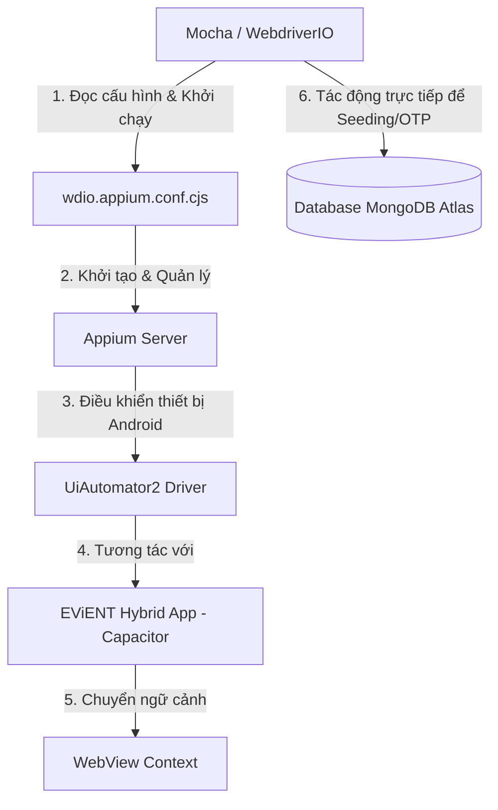

# TÀI LIỆU ĐỌC HIỂU & PHÂN TÍCH MÃ NGUỒN APPIUM AUTOMATION (EViENT)
*Tài liệu hỗ trợ thuyết trình và giải thích cho Giảng viên*

---

## 1. TỔNG QUAN KIẾN TRÚC & CÔNG NGHỆ AUTOMATION

Hệ thống kiểm thử tự động (Automation Testing) cho ứng dụng di động **EViENT** được xây dựng trên mô hình kiểm thử tích hợp đầu-cuối (End-to-End - E2E) dành cho ứng dụng lai (Hybrid App). 

### Sơ đồ luồng hoạt động công nghệ:


### Các công nghệ cốt lõi:
1. **WebdriverIO (WDIO)**: Khung kiểm thử (Test Runner) chạy trên Node.js, cung cấp cú pháp đơn giản, mạnh mẽ để giao tiếp với Appium.
2. **Appium**: Công cụ mã nguồn mở giúp tự động hóa ứng dụng di động (Android).
3. **UiAutomator2**: Trình điều khiển (Driver) do Google cung cấp để Appium tương tác trực tiếp với các phần tử native của hệ điều hành Android.
4. **Mocha & Expect**: Mocha đóng vai trò định nghĩa cấu trúc kịch bản kiểm thử (`describe`, `it`, `before`, `after`), còn thư viện `Expect` dùng để kiểm tra tính đúng đắn của kết quả (Assertion).
5. **MongoDB Driver**: Kết nối trực tiếp cơ sở dữ liệu MongoDB Atlas để nạp dữ liệu kiểm thử (Seeding) và lấy mã OTP thời gian thực, giúp tự động hóa hoàn toàn luồng đăng ký/đăng nhập mà không phụ thuộc vào dịch vụ gửi SMS/Email thật.
6. **Capacitor (Hybrid App)**: Ứng dụng di động EViENT được xây dựng bằng công nghệ Web nhưng đóng gói chạy trên Native Android thông qua WebView container.

---

## 2. CẤU TRÚC THƯ MỤC CỦA PHẦN AUTOMATION

```text
automation/
├── wdio.appium.conf.cjs       # File cấu hình trung tâm cho WebdriverIO & Appium
├── appium/
│   ├── helpers/
│   │   ├── app.cjs           # Tập hợp các hàm tương tác giao diện (UI Helpers)
│   │   └── test-data.cjs     # Tập hợp các hàm truy cập DB & chuẩn bị dữ liệu (DB Helpers)
│   └── specs/
│       ├── auth.e2e.spec.cjs # Các kịch bản kiểm thử luồng Đăng ký, Đăng nhập, OTP
│       └── admin.e2e.spec.cjs# Các kịch bản kiểm thử dành cho quyền Quản trị viên (Admin)
```

---

## 3. PHÂN TÍCH CHI TIẾT TỪNG FILE MÃ NGUỒN

### 3.1. File cấu hình: `wdio.appium.conf.cjs`
Đây là "trái tim" của hệ thống kiểm thử, thiết lập môi trường hoạt động cho Appium và WebdriverIO.

*   **Chỉ định ứng dụng APK cần test:**
    ```javascript
    const apkPath = process.env.EVIENT_APK_PATH
      || path.join(mobileAppDir, 'android', 'app', 'build', 'outputs', 'apk', 'debug', 'app-debug.apk');
    ```
    *Ý nghĩa:* Tự động tìm kiếm file cài đặt APK đã được build ở thư mục native Android để cài đặt lên thiết bị giả lập.

*   **Cấu hình Capabilities (Khả năng tương tác của Appium):**
    ```javascript
    capabilities: [{
      platformName: 'Android',
      'appium:automationName': 'UiAutomator2',
      'appium:deviceName': process.env.EVIENT_ANDROID_DEVICE || 'Android Emulator',
      'appium:app': apkPath,
      'appium:autoWebview': true, // CỰC KỲ QUAN TRỌNG
      'appium:autoWebviewTimeout': 20000,
      'appium:chromedriverAutodownload': true,
    }]
    ```
    *Phân tích điểm nổi bật cho GV:*
    *   `'appium:autoWebview': true`: Vì EViENT là Hybrid App (Capacitor), giao diện thực chất chạy trên một trình duyệt thu nhỏ (WebView) bên trong ứng dụng Android native. Thuộc tính này ra lệnh cho Appium tự động chuyển từ ngữ cảnh "Native" sang "WebView" ngay khi app khởi động, giúp kiểm thử viên có thể sử dụng các selector của Web chuẩn như CSS selector (`[data-testid="..."]`) để tìm kiếm element thay vì phải dùng XPath phức tạp của Android.
    *   `'appium:chromedriverAutodownload': true`: Tự động tải phiên bản ChromeDriver phù hợp để điều khiển WebView tùy theo phiên bản Android của thiết bị giả lập.

*   **Tự động quản lý Appium Service:**
    ```javascript
    services: [
      ['appium', {
        command: 'appium',
        args: { address: '127.0.0.1', port: 4723, relaxedSecurity: true },
      }],
    ]
    ```
    *Ý nghĩa:* Người dùng không cần phải bật server Appium thủ công bằng dòng lệnh. WebdriverIO sẽ tự khởi động Appium Server ở cổng `4723` trước khi chạy test và tự tắt sau khi hoàn thành.

---

### 3.2. File thư viện tương tác UI: `appium/helpers/app.cjs`
File này đóng gói các tác vụ giao diện lặp đi lặp lại để mã nguồn kiểm thử trong các file spec ngắn gọn và sạch sẽ hơn.

*   **Chuyển đổi ngữ cảnh (Context Switching):**
    ```javascript
    async function switchToWebView(timeoutMs = 30000) {
      // Đợi và quét các context hiện có, tìm context có chữ 'WEBVIEW'
      // Sau đó gọi browser.switchContext(webViewContext) để chuyển quyền điều khiển vào WebView
    }
    ```
    *Giải thích cho GV:* Đảm bảo các câu lệnh kiểm thử luôn tác động chính xác vào bên trong vùng WebView chứa giao diện Web của ứng dụng di động.

*   **Lấy trạng thái hợp lệ của thẻ HTML (HTML5 Validation API):**
    ```javascript
    async function getFieldValidity(selector) {
      await switchToWebView();
      return browser.execute((targetSelector) => {
        const element = document.querySelector(targetSelector);
        if (!element) return null;
        return {
          valid: element.checkValidity(),
          validationMessage: element.validationMessage || '',
          value: element.value || '',
        };
      }, selector);
    }
    ```
    *Phân tích điểm nổi bật:* Hàm này sử dụng `browser.execute()` để nhúng mã JavaScript chạy trực tiếp trong trình duyệt (WebView). Nó tận dụng API chuẩn của HTML5 (`checkValidity()`) để kiểm tra xem một trường nhập liệu có vi phạm ràng buộc không (ví dụ: để trống email, nhập sai định dạng email), giúp chứng minh ứng dụng ngăn chặn sai sót ngay từ phía Client.

*   **Nhập mã OTP chia nhỏ (OTP Input Fields):**
    ```javascript
    async function fillOtpCode(otpCode) {
      const digits = String(otpCode).split('');
      for (let index = 0; index < digits.length; index += 1) {
        const input = await waitForTestId(`otp-input-${index}`, 15000);
        await clickElement(input);
        await input.setValue(digits[index]);
      }
    }
    ```
    *Ý nghĩa:* Giao diện nhập OTP thường có 6 ô nhập số riêng biệt. Hàm này tách mã OTP thành mảng ký tự và điền lần lượt vào từng ô nhập liệu `otp-input-0` đến `otp-input-5` một cách tuần tự.

---

### 3.3. File kết nối và xử lý dữ liệu: `appium/helpers/test-data.cjs`
Đây là phần nâng cao thể hiện tư duy kiến trúc kiểm thử chuyên nghiệp. Thay vì kiểm thử giao diện một cách "cô lập", hệ thống kết nối trực tiếp đến cơ sở dữ liệu MongoDB để thao tác dữ liệu phía backend.

*   **Nạp dữ liệu người dùng mẫu (Database Seeding) với mật khẩu bảo mật mã hóa:**
    ```javascript
    async function upsertUser({ email, fullName, password, role = 'user', isActive = true }) {
      const db = await getAuthDb();
      const passwordHash = await bcrypt.hash(password, bcryptRounds); // Mã hóa Bcrypt chuẩn
      await db.collection('users').updateOne(
        { email: normalizedEmail },
        { $set: { email: normalizedEmail, fullName, passwordHash, role, isActive, ... } },
        { upsert: true } // Nếu chưa có thì tạo mới, có rồi thì cập nhật
      );
    }
    ```
    *Giải thích cho GV:* Đảm bảo trước khi kiểm thử, tài khoản dùng để đăng nhập luôn tồn tại trong cơ sở dữ liệu với đúng mật khẩu đã được băm (hash) bằng thư viện `bcryptjs` tương thích hoàn toàn với thuật toán bảo mật của Backend thực tế.

*   **Đọc trực tiếp mã OTP từ MongoDB (Real-time OTP Bypass):**
    ```javascript
    async function waitForLatestOtp({ email, type, timeoutMs = 30000, pollIntervalMs = 500 }) {
      const db = await getAuthDb();
      const startedAt = Date.now();
      while (Date.now() - startedAt < timeoutMs) {
        const otpCode = await db.collection('otpcodes')
          .find({ email: normalizedEmail, type, isUsed: false, expiresAt: { $gt: new Date() } })
          .sort({ createdAt: -1, _id: -1 })
          .limit(1)
          .next();
        if (otpCode?.code) return String(otpCode.code);
        await new Promise((resolve) => setTimeout(resolve, pollIntervalMs)); // Polling mỗi 500ms
      }
      throw new Error(...);
    }
    ```
    *Phân tích điểm nổi bật cho GV:* Đây là **kỹ thuật Polling**. Khi chạy test đăng ký, hệ thống gửi yêu cầu đăng ký lên máy chủ. Máy chủ xử lý và ghi mã OTP mới vào bảng `otpcodes` trong DB. Script test sẽ chạy vòng lặp liên tục quét cơ sở dữ liệu mỗi 500ms để tìm mã OTP mới nhất chưa được sử dụng và chưa hết hạn của email đó. Ngay khi tìm thấy, mã này được trả về để điền vào màn hình OTP của thiết bị di động. Nhờ đó, việc đăng ký diễn ra tự động hoàn toàn trong vòng vài giây.

---

### 3.4. Các kịch bản kiểm thử: `appium/specs/auth.e2e.spec.cjs`
File này chứa 8 ca kiểm thử (Test Cases) bao quát toàn bộ các luồng Đăng nhập, Đăng ký và Xác thực của người dùng.

| Mã Test Case | Tên Kịch Bản Kiểm Thử | Cơ Chế Kiểm Tra (Validation Mechanism) |
| :--- | :--- | :--- |
| **AUTH-01** | Chặn đăng nhập khi bỏ trống Email | Kiểm tra API HTML5: Ràng buộc tính hợp lệ (`checkValidity` = false) của trường Email. |
| **AUTH-02** | Chặn đăng nhập khi bỏ trống Mật khẩu | Kiểm tra API HTML5: Ràng buộc tính hợp lệ của trường Mật khẩu. |
| **AUTH-03** | Hiển thị lỗi khi đăng nhập sai mật khẩu | Nhập thông tin sai $\rightarrow$ click gửi $\rightarrow$ đợi Toast thông báo lỗi hiển thị bằng tiếng Việt: *"Email hoặc mật khẩu không đúng"*. |
| **AUTH-04** | Chặn đăng ký khi bỏ trống Họ tên | Kiểm tra trường Họ tên có yêu cầu nhập dữ liệu (required field validation). |
| **AUTH-05** | Báo lỗi khi đăng ký với Email đã tồn tại | Sử dụng tài khoản đã seeded $\rightarrow$ tiến hành đăng ký mới $\rightarrow$ nhận Toast thông báo lỗi: *"Email đã được đăng ký"*. |
| **AUTH-06** | Báo lỗi khi nhập sai mã OTP | Đăng ký thành công $\rightarrow$ lấy OTP thật từ DB $\rightarrow$ biến đổi chữ số đầu tiên để tạo OTP sai $\rightarrow$ xác nhận $\rightarrow$ nhận Toast báo lỗi: *"Mã OTP không hợp lệ hoặc đã hết hạn"*. |
| **AUTH-07** | Đăng ký thành công tài khoản mới bằng OTP thật | Đăng ký $\rightarrow$ quét lấy OTP thật từ MongoDB Atlas $\rightarrow$ điền OTP chuẩn $\rightarrow$ xác minh chuyển hướng thành công đến màn hình chính `home-page`. |
| **AUTH-08** | Đăng nhập tài khoản có sẵn ở chế độ Bỏ qua OTP (OTP-skip) | Kiểm thử chế độ phát triển (Developer Mode) giúp đăng nhập trực tiếp qua Form cực nhanh để kiểm chứng luồng UI sau đăng nhập. |

---

### 3.5. Kịch bản kiểm thử quản trị: `appium/specs/admin.e2e.spec.cjs`
Kịch bản này kiểm tra phân quyền người dùng và luồng công việc của Quản trị viên (Admin).

*   **Test Case 1: Đăng nhập quyền Admin thành công**
    *   Tự động nạp người dùng mới có role là `'admin'`.
    *   Thực hiện đăng nhập $\rightarrow$ Đợi và kiểm tra sự xuất hiện của trang Dashboard quản trị (`admin-dashboard-page`).
*   **Test Case 2: Tìm kiếm người dùng mẫu trên trang quản lý Admin**
    *   Sau khi đăng nhập Admin, chương trình mô phỏng thao tác mở Menu Sidebar của di động (`admin-sidebar-toggle`).
    *   Nhấp chọn chuyển trang Quản lý người dùng (`admin-nav-nguoi-dung`).
    *   Tìm kiếm ô tìm kiếm (`admin-users-search-input`), nhập email của tài khoản Admin vừa seeded.
    *   Sử dụng lệnh đợi thông minh `browser.waitUntil` để xác minh xem email admin có hiển thị trong danh sách kết quả tìm kiếm trên màn hình hay không.

---

## 4. CÁC ĐIỂM SÁNG KỸ THUẬT NỔI BẬT ĐỂ BÁO CÁO GIÁO VIÊN

Khi giáo viên đặt câu hỏi: **"Điểm đặc biệt/nâng cao trong phần code Automation này là gì?"**, hãy trình bày 4 luận điểm đắt giá sau:

1.  **Xử lý chuyển đổi Ngữ cảnh ứng dụng lai (Hybrid App Context Switch) tự động:**
    *   *Cách giải thích:* EViENT được phát triển bằng framework Capacitor. Ứng dụng chạy trên thiết bị thực tế dưới dạng ứng dụng Android bản địa (Native) chứa một WebView. Kịch bản test của chúng em được lập trình để tự động phát hiện, chờ đợi và chuyển quyền kiểm khiển vào WebView một cách mượt mà (`switchToWebView`), giúp tận dụng tối đa tốc độ quét phần tử bằng CSS selector truyền thống của lập trình Web.
2.  **Khử phụ thuộc bên ngoài bằng kết nối Database trực tiếp (Real DB Seeding & OTP Bypass):**
    *   *Cách giải thích:* Thay vì dùng các mock server giả lập dữ liệu tĩnh hoặc phải tương tác thủ công bằng tay để điền OTP, hệ thống kiểm thử này có khả năng kết nối trực tiếp đến cơ sở dữ liệu MongoDB Atlas của dự án. Chúng em tự động khởi tạo dữ liệu mẫu trước mỗi bộ kiểm thử (`before`) và dọn dẹp sạch sẽ sau khi hoàn thành (`after`) nhằm giữ cho cơ sở dữ liệu luôn nhất quán. Đồng thời, kỹ thuật **Polling** liên tục quét bảng mã xác thực giúp lấy mã OTP thật thời gian thực để vượt qua bước bảo mật OTP tự động 100%.
3.  **Tối ưu hóa thời gian chờ đợi (Smart Explicit Waits):**
    *   *Cách giải thích:* Thay vì sử dụng các hàm ngủ cứng (như `sleep(5000)` gây lãng phí thời gian và dễ gây lỗi khi mạng chậm), chúng em thiết lập cơ chế đợi thông minh dựa trên phần tử giao diện (`waitForTestId` hay `browser.waitUntil`). Hệ thống chỉ chờ cho đến khi phần tử xuất hiện rồi thực hiện bước tiếp theo ngay lập tức, tối ưu hóa tốc độ chạy của toàn bộ bộ kiểm thử.
4.  **Kiểm tra tính hợp lệ cấp trình duyệt (Native HTML5 Form Validation Testing):**
    *   *Cách giải thích:* Tránh việc chỉ kiểm tra giao diện đơn thuần, hệ thống đã nhúng code kiểm tra trực tiếp đối tượng DOM trong WebView thông qua phương thức `getFieldValidity`. Điều này đảm bảo các quy tắc kiểm tra dữ liệu đầu vào (Form validation) của HTML5 hoạt động ổn định và chính xác trên môi trường thiết bị di động.

---

## 5. GỢI Ý KỊCH BẢN THUYẾT TRÌNH TRƯỚC HỘI ĐỒNG (5 PHÚT)

*   **Phút 1: Giới thiệu chung:**
    > *"Kính thưa thầy cô, để đảm bảo chất lượng phần mềm ứng dụng EViENT trên nền tảng di động, nhóm chúng em đã xây dựng một bộ kiểm thử tự động toàn diện sử dụng sự kết hợp giữa WebdriverIO và Appium. Ứng dụng di động của chúng em là một Hybrid App viết bằng Capacitor, do đó chiến lược kiểm thử tập trung vào việc tự động hóa tương tác bên trong WebView."*

*   **Phút 2-3: Giới thiệu Kiến trúc & Điểm sáng kỹ thuật (Trực quan hóa bằng code):**
    > *"Điểm nhấn kỹ thuật đầu tiên là file cấu hình `wdio.appium.conf.cjs`. Chúng em đã cấu hình `'appium:autoWebview': true` cùng trình điều khiển `UiAutomator2`. Điều này cho phép kịch bản test tự động điều hướng vào WebView ngay khi khởi động."*
    >
    > *"Điểm nhấn thứ hai là giải pháp vượt qua bước OTP mà không làm giảm tính bảo mật của hệ thống. Thay vì bỏ qua bước này ở phía backend, chúng em thực hiện một quy trình kiểm thử tích hợp thực tế: hệ thống đăng ký tài khoản mẫu, sau đó script test sẽ thực hiện truy vấn trực tiếp cơ sở dữ liệu MongoDB Atlas theo thời gian thực để lấy OTP vừa được gửi đi để điền tự động vào thiết bị di động. Điều này giúp kiểm thử được trọn vẹn 100% chức năng bảo mật thực tế của ứng dụng."*

*   **Phút 4: Demo kịch bản Auth & Admin:**
    > *"Chúng em đã cài đặt 8 ca kiểm thử chi tiết cho luồng Xác thực (từ AUTH-01 đến AUTH-08) để kiểm tra các hành vi như chặn trường để trống, báo sai mật khẩu, báo trùng email và luồng đăng ký thành công. Đối với tài khoản quản trị (Admin), kịch bản cũng tự động kiểm tra xem Admin có thể truy cập dashboard quản lý và thực hiện tìm kiếm tài khoản người dùng thành công hay không."*

*   **Phút 5: Kết luận & Giải đáp câu hỏi:**
    > *"Kết quả là bộ kiểm thử tự động của chúng em chạy hoàn toàn độc lập, nhanh chóng, tự động tạo và dọn dẹp dữ liệu kiểm thử trên database sau khi hoàn thành. Nhóm chúng em xin sẵn sàng nhận câu hỏi phản biện từ thầy cô. Em xin cảm ơn!"*
